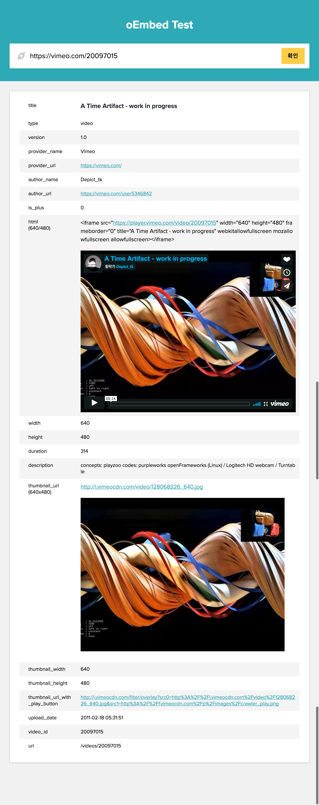

- oEmbed 관련예제
```
oEmbed는 다른 사이트의 URL을 내장된 표현을 가능하게 하는 Format 입니다.
유저가 Resource 에 해당하는 링크를 입력할 때, 웹사이트들이 Resource를 직접 파싱하지 않고, 내장된 컨텐츠(사진과 비디오같은)를 보여줄 수 있게 하는 간단한 API 
```

## 내용
youtube, instagram, twitter, vimeo 등의 컨텐츠를 미리보여줌.
URL을 입력받고 [oEmbed](http://oembed.com/) 데이터를 수집하여 보여주는 서비스입니다.

테스트 URL 리스트
- https://www.youtube.com/watch?v=dBD54EZIrZo
- https://vimeo.com/20097015

## 참고 사이트

- [http://oembed.com/](http://oembed.com/)

## 결과 샘플

URL을 입력받는 폼을 만들고 확인 버튼을 누르면 해당 URL에 대한 oembed 정보를 출력하고 `html`값과 `thumbnail_url`은 미리보기로 보여줍니다.


